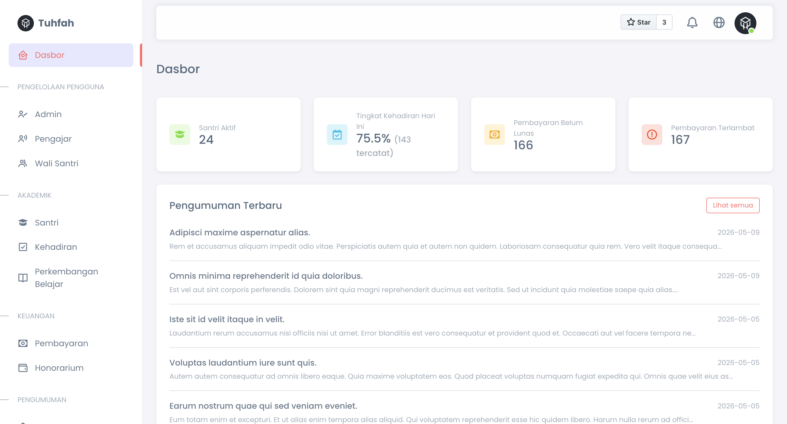

<div align="center">
    <p>
        <a href="https://github.com/404NotFoundIndonesia/" target="_blank">
            
        </a>
    </p>

[](https://github.com/404NotFoundIndonesia/tuhfah-webapp/stargazers)
[](https://github.com/404NotFoundIndonesia/tuhfah-webapp/blob/main/LICENSE)
[](https://github.com/404NotFoundIndonesia/tuhfah-webapp/actions/workflows/test.yml)
[](https://www.php.net/)
[](https://laravel.com/)

</div>

# Tuhfah — Islamic Education Management System

**Tuhfah** is a comprehensive information and management system built for Islamic Education Parks (Taman Pendidikan Al-Qur'an / TPQ) and Islamic Education Centers (Taman Pendidikan Agama / TPA). It provides a unified platform for administrators, teachers, and student guardians to manage every aspect of institution operations — from student registration and attendance to financial payments and learning progress reports.

> **Tuhfah** (تُحْفَة) is an Arabic word meaning *gift* or *masterpiece* — reflecting the goal of delivering an exceptional tool to support Islamic education.




---

## Features

### Role-Based Access Control
Five distinct roles with scoped permissions: **Owner**, **Headmaster**, **Administrator**, **Teacher**, and **Student Guardian**. Each role sees only what they need.

### Student Management
Register and manage student profiles including personal details, gender, enrollment status, and guardian assignment. Student IDs are auto-generated using the Hijri calendar for a culturally relevant identifier.

### Attendance Tracking
- Batch attendance recording for all active students in one form
- Teachers can submit their own daily self-attendance
- Guardians receive in-app (and optional email) notifications when their child is absent, sick, or on permitted leave
- Monthly summary statistics per student

### Learning Progress Monitoring
Teachers record subject-by-subject milestones with optional scores and notes. Progress is visualized through interactive charts (ApexCharts). Guardians are notified when a new record is saved for their child.

### Financial Management
- **Tuition Payments** — record, track, and mark payments per student per period
- **Teacher Honorariums** — record and manage monthly salary disbursements
- **Overdue Detection** — a scheduled Artisan command automatically transitions unpaid payments past their due date to *Overdue* and notifies guardians and administrators
- **Midtrans Integration** — guardians can pay outstanding fees directly via a payment gateway
- **Export** — download payment and honorarium reports as XLSX or PDF

### Announcements
Administrators can draft and publish announcements scoped as **Public** (visible on the welcome page without login) or **Internal** (visible only to authenticated users). Drafts can be scheduled or published immediately.

### Notification System
In-app notification bell with unread badge. Notifications are dispatched for:
- Student absences / sick / permitted leave → guardian
- Payment overdue → guardian + all administrators
- New learning progress entry → guardian

Users can opt out of email delivery per their profile preferences.

### Inventory Management
Track institution assets with full condition monitoring (Good / Damaged / Lost). Administrators can log usage and disposal events, each of which decrements stock automatically. Full usage history is retained per item.

### Reporting & Analytics
Generate and export three report types:
- **Attendance Report** — present / absent / sick / permitted counts per student for a weekly or monthly period, with attendance percentage
- **Financial Report** — collected, outstanding, and overdue payment totals alongside honorarium disbursements and net income for a selected month
- **Progress Report** — all learning progress entries for a specific student within a date range

All reports are exportable as **XLSX** or **PDF**. Teachers can access progress reports scoped to their own students only.

---

## Tech Stack

| Layer | Technology |
|---|---|
| Backend | PHP 8.2+, Laravel 11 |
| Database | MySQL (production), SQLite in-memory (tests) |
| Frontend | Bootstrap 5, jQuery, ApexCharts |
| Auth | Laravel Breeze (session-based) |
| Payments | Midtrans (Snap) |
| Excel Export | Maatwebsite Laravel Excel |
| PDF Export | barryvdh/laravel-dompdf |
| DataTables | Yajra Laravel DataTables |
| Hijri Calendar | pharaonic/laravel-hijri |
| Testing | PHPUnit 11, 400+ tests |

---

## Getting Started

### Requirements

- PHP 8.2+
- Composer
- MySQL 8+ (or SQLite for local development)
- Node.js (only if you modify front-end assets)

### Installation

**1. Clone the repository**

```shell
git clone git@github.com:404NotFoundIndonesia/tuhfah-webapp.git
cd tuhfah-webapp
```

**2. Run the setup script**

```shell
composer setup
```

This single command installs dependencies, copies `.env.example` to `.env`, generates the application key, caches config, runs migrations, and links storage.

**3. Configure your environment**

Open `.env` and set your database credentials and any third-party service keys:

```dotenv
DB_CONNECTION=mysql
DB_HOST=127.0.0.1
DB_PORT=3306
DB_DATABASE=tuhfah
DB_USERNAME=root
DB_PASSWORD=

# Midtrans payment gateway (optional)
MIDTRANS_SERVER_KEY=
MIDTRANS_CLIENT_KEY=
MIDTRANS_IS_PRODUCTION=false
```

**4. Start the development server**

```shell
php artisan serve
```

Open [http://localhost:8000](http://localhost:8000) in your browser.

---

## Running Tests

The test suite uses an in-memory SQLite database — no separate database setup required.

```shell
php artisan test
```

Expected output: **407 tests, 710 assertions, 0 failures.**

---

## Scheduled Commands

Register the scheduler in your server's cron to enable automatic overdue detection:

```cron
* * * * * cd /path-to-your-project && php artisan schedule:run >> /dev/null 2>&1
```

The `payments:mark-overdue` command runs daily and transitions eligible unpaid payments to *Overdue*, dispatching notifications to guardians and administrators.

---

## Project Structure

```
app/
├── Console/Commands/       # MarkOverduePayments
├── Enum/                   # Role, AttendanceStatus, PaymentStatus, AnnouncementScope, ItemCondition, ...
├── Exports/                # PaymentExport, HonorariumExport, AttendanceReportExport, FinanceReportExport (XLSX + PDF)
├── Http/Controllers/       # Feature controllers per domain
├── Models/                 # Eloquent models
├── Notifications/          # StudentAbsent, PaymentOverdue, NewLearningProgress
└── Services/               # AttendanceService, DashboardService, PaymentGatewayService
```

---

## Reference

- [Effendi, M. Iqbal dan Nafila Fayruz. 2021. *Sistem Informasi dan Manajemen Taman Pendidikan Al-Qur'an Imam Syafi'i Banjarmasin Berbasis Web dan Aplikasi Android.* Tugas Akhir Diploma 3. Banjarmasin: Politeknik Negeri Banjarmasin.](https://drive.google.com/file/d/1IcnC0AzTEy1HQBOAmqEvJy7vNhtv4uMu/view?usp=sharing)

- [Fitri dkk. (2022). Sistem Informasi dan Manajemen Taman Pendidikan Al-Qur'an Imam Syafi'i Banjarmasin Berbasis Web. *Jurnal Impact*, 4(1), 4–11.](https://ejurnal.poliban.ac.id/index.php/impact/article/view/1252/965)

---

## License

**Tuhfah Web Application** is open-source software licensed under the [MIT License](https://github.com/404NotFoundIndonesia/tuhfah-webapp/blob/main/LICENSE).
